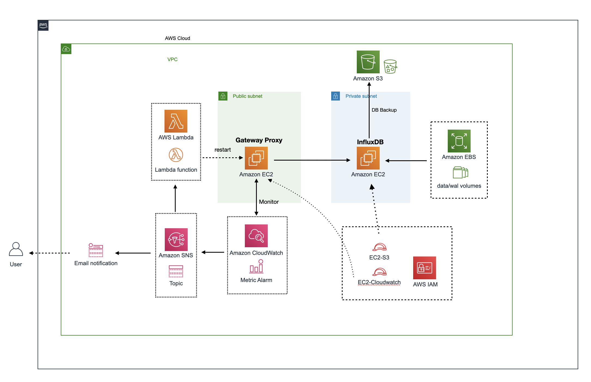

## GitHub Cloud Proxy Infra

This repository contains terraform infrastructure as code for building the infrastructure components (AWS resources) for the GitHub Cloud Proxy application.



## Prerequisites
Make sure all following prerequisites are followed

### 1. Terraform installed (v0.13.2)

### 2. aws-cli
install aws-cli

### 3. Create KeyPair on AWS Console
These Terraform configurations support attaching a key_pair to the ec2 instances to enable ssh onto those servers provisioned as a way for troubleshooting where necessary although generally not required.

To make things simple, to run these Terraform configurations would require a key pair to be created beforehand.


## Setup Terraform State

```bash
cd infrastructure-global/state
terraform init
terraform plan
terraform apply
```

## Deploying Infrastructure

```bash
cd infrastructure-platform/src/environments/{environment}
terraform init ../../
terraform plan ../../ -var-file=placeholder.tfvars
terraform apply ./../ -var-file=placeholder.tfvars
```

where {environment} is any of "dev", "staging", "prod"

The terraform code does the following...

1. Setup IAM Roles
2. Create S3 Bucket for storing InfluxDB Backups
3. Create EBS Volumes for InfluxDB backing storage
4. Setting up the network VPC
5. Provision the InfluxDB instance
6. Provision the Java Proxy instance
7. Creating SNS Topic for notifications
8. Creating Cloudwatch Metric Alarms for Monitoring
9. Create Lamdba function to reboot the ec2 instances